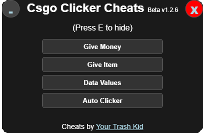

# Case Clicker Mod Menu
### Made by Your-Trash-Kid

The game can be found at https://mtsl.dk/csgo/

This mod menu is for FUN and is not to be used in any online/competitive versions of the game, this is made for https://mtsl.dk/csgo/ only and offline mode only for your own experience of a virus-free mod menu for simple use.

# How to use
This mod menu will try to be updated daily and updated to work with new versions of the game.

## (Step One) Open Console: 
From https://mtsl.dk/csgo/, use the following:

* **Windows:** `Ctrl + Shift + i`

* **Chromebook/Chrome:** `Ctrl + Shift + i`

* **Mac**: `Command + Option + i` (To Enable: `Preferences -> Advanced tab -> Show Develop menu`)

## (Step Two) Copy Code:
Head over to the [Gui.js](https://github.com/Your-Trash-kid/Case-Clicker-Mod-Menu/blob/main/Gui.js) file in the github and copy the code.

## (Step Three) Opening The Right Sidebar Tab:
Go back to https://mtsl.dk/csgo/ and in your inspect element side bar you just opened on **Step One** go to the section **Console** at the top.

## (Step Four) Pasting The Code:
In your inspect element sidebar use the following to paste the code and press `Enter`:

* **Windows:** `Ctrl + V`

* **Chromebook/Chrome:** `Ctrl + V`

* **Mac:** `Command + V`

## (Step Five) Enjoy:
You have now successfully injected our case clicker mod menu, make sure to share with a friend and star this github repository to get it to more people, Remember you can press `E` to hide the menu if it gets in your way!

If you happen to update, please make a pull request for others to benefit, thanks!
Any copy's please credit!
